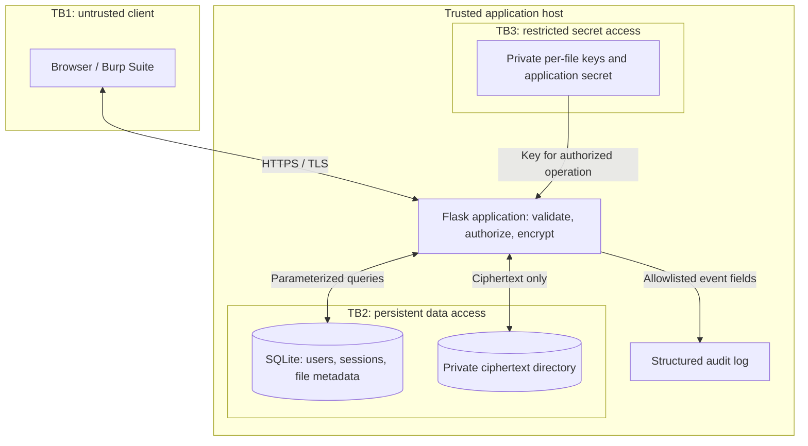

# Checkpoint 1: threat model and architecture

**Course:** ICS0027 Web Application Security, 2026/2027  
**Project:** Secure Web-Based File Encryption and Management System  
**Deadline in assignment:** 21 September 2026  
**Status:** Initial design for student review. Controls below are planned unless
explicitly listed as implemented in the README.

## 1. Goal and scope

Build a small application where a user registers, logs in and manages only their
own files. The server validates each upload, encrypts the contents, records its
owner and returns the original bytes only after authorization. The planned first
release accepts `.txt` and `.pdf` files, from 1 byte to 5 MiB, with a 50 MiB
per-user quota. These limits are project decisions, not lecturer-mandated values.

Shared links, folder hierarchies, file editing, previews, URL imports, cloud
integration and administration are outside the initial scope. A filename is a
display label, never a server path. All file contents are immutable: replacing a
file means a new upload with a new identifier and key.

This draft assumes development from scratch because no ICS0022 source was
available. The assignment describes building on ICS0022; confirm with the lecturer
whether reuse is required. The current repository contains no reused course code.

## 2. Architecture and trust boundaries

TB1 crosses from attacker-controlled requests into server logic. Every request,
header, cookie, field and filename needs server validation. Hidden controls and
JavaScript checks cannot establish permission.

TB2 separates application decisions from database and filesystem access. Records
are selected by authenticated owner; disk names are generated UUIDs. Neither
storage directory is exposed as static web content.

TB3 represents a separate access policy and location for secrets, not a separate
machine or protection from an attacker running as the application user. The server
must access keys to decrypt; compromise of that host can compromise plaintext.

**Protection objective:** a copy of the database and ciphertext store, without the
separate key directory, must not reveal file contents. Filenames, sizes, timestamps
and ownership metadata remain visible in a database copy. The application is
server-side encrypted; it is not end-to-end encrypted or zero-knowledge.

## 3. Technology decisions

| Component | Choice | Reason and trade-off |
| --- | --- | --- |
| Language | Python 3.12 | One language for application, prototype and tests. |
| Web framework | Flask with Jinja templates | Small, inspectable request flow; HTML output escaping supported. Security extensions still need deliberate configuration. |
| Interface | Server-rendered HTML and minimal CSS | Avoids a separate frontend build and token storage in browser JavaScript. |
| Database access | SQLAlchemy with SQLite; Flask-SQLAlchemy integration | Bound parameters and transactions; no separate DB service for the lab. SQLite suits a small single-host demo, not high concurrency. |
| Passwords | Argon2id through `argon2-cffi` | Password verification uses a slow password hash; file encryption keys are independent. |
| Authentication | Flask-Login | Tracks logged-in users; does not implement hashing, ownership checks or session revocation by itself. |
| Session storage | Flask-Session with SQLAlchemy backend | Opaque cookie identifier; session data on server; enables rotation and revocation. |
| Form protection | Flask-WTF CSRFProtect | Validate CSRF tokens on every state-changing form, including login. |
| File encryption | `cryptography` AESGCM | Authenticated encryption; verify integrity before releasing plaintext. |
| Verification | pytest and manual Burp Repeater cases | Automated regressions plus reproducible HTTP attack evidence. |
| Development TLS | Local certificate and TLS-enabled loopback server | Reproducible HTTPS without paid hosting; browser trust must be established for the graded demonstration. |

Only Flask, cryptography and testing dependencies are installed in this scaffold.
The other libraries are planned for Checkpoint 2 and will be pinned when integrated.
Flask security behavior is described in its [official guidance][flask-security].

## 4. Data and file lifecycle

Planned records:

| Record | Main fields | Protection |
| --- | --- | --- |
| User | UUID, unique normalized username, Argon2id hash, creation time | Never store the login password. |
| File | UUID, owner UUID, safe display name, validated type, byte count, state, creation time | Owner is assigned from the session; FK and constraints enabled. No raw key or file content in this table. |
| Session | Opaque identifier and server-side user/CSRF/lifetime state | Extension-managed storage, expiry and deletion; never log the bearer identifier. |

**Upload:** authenticate and validate CSRF; enforce request and user limits; validate
filename/type/content; generate identifiers; encrypt in bounded memory; create key
and ciphertext with exclusive file creation; commit metadata as `active`. Files are
stored as `<uuid>.sfm`. Key files are `<uuid>.key` in a separate private directory.
Client-supplied ownership or path fields are never accepted.

`.txt` content must decode as UTF-8 and contain no NUL bytes. `.pdf` requires the
expected header and matching extension. MIME claims from the browser are only a
consistency signal. A PDF header check is not proof that a document is harmless.
No document is rendered, executed or parsed on the server; downloads are forced
attachments with `application/octet-stream` and `nosniff`.

Multipart parsers can spool plaintext to temporary disk. Before enabling uploads,
configure a bounded in-memory file stream and verify with a file above the default
spooling threshold. The total HTTP request cap is 6 MiB, allowing form overhead;
the file itself still has a separate 5 MiB cap. Check quota inside the metadata
transaction so concurrent uploads cannot bypass it.

**Download:** select an `active` row with both file UUID and authenticated owner UUID;
otherwise return the same `404` for missing and foreign files. Only then read the
key and ciphertext. Verify the authentication tag fully before responding with
bytes. A wrong owner binding in AES-GCM is additional integrity protection, not a
replacement for this HTTP ownership check. Use `Cache-Control: no-store`.

**Delete:** validate authentication, CSRF and ownership; mark `deleting` so new reads
fail; remove the per-file key, ciphertext and metadata; record outcome. A failed
cleanup remains inaccessible and is retried; never report completed deletion while
required removals failed. SQLite transactions cannot atomically delete OS files:
use explicit lifecycle states and startup reconciliation for incomplete uploads
and deletions. Serialize download/delete per file in the single-process lab so a
new download cannot slip past deletion; bytes already delivered cannot be recalled.

## 5. Cryptographic design and deletion limits

The initial prototype implements a proposed format:

| Element | Decision |
| --- | --- |
| Data key | Fresh random 256-bit AES key per immutable file. |
| Nonce | Fresh random 12 bytes per encryption. |
| Payload | Four-byte version marker `SFM` + `0x01`, nonce, ciphertext and 16-byte tag. |
| Associated data | Version marker, canonical file UUID bytes and owner UUID bytes. |
| Failure | Reject invalid format, key, tag or binding with a generic error. |
| Password relationship | Login password verifies identity; it does not generate file keys. |

AES-GCM requires correct nonce use and rejects failed authentication; the project
uses the library implementation rather than implementing the cipher. See the
[AESGCM API][aesgcm].

For this local lab, keys will live in a private directory outside the repository
and ciphertext directory: POSIX directory mode `0700`, key mode `0600`, or
equivalent NTFS ACLs. The application secret used for CSRF/session-related signing
is independently generated and stored as another protected file. Configure only
paths in environment variables. Key values must not enter Git, logs or responses.
Missing key material must cause failure, never silent key replacement.

This is a deliberately limited local key-store design, informed by [OWASP key
storage guidance][crypto-storage]. There is no HSM or external key service; the
application account and host administrator can read the keys. Loss of a file key
means loss of that file. Automated rotation and backup recovery are outside this
release; suspected compromise requires removing access, investigating, and
re-encrypting retained data with new keys if safe recovery is possible.

**Secure deletion is not proved by calling `unlink`.** The intended behavior removes
the live file and its unique key, but SSD remapping, snapshots, key backups, swap
and memory copies can preserve recoverable material. Python does not guarantee
memory zeroization. The lab uses synthetic data and no application backups; this
does not prove the host has no snapshots. Confirm the expected deletion guarantee
with the lecturer. Document logical deletion and key removal as measured behavior,
and never claim certified physical sanitization or guaranteed cryptographic erasure.

## 6. Authentication, sessions and browser controls

Planned login policy: Argon2id with a random salt and recorded parameters; start
with `m=19456 KiB`, `t=2`, `p=1`, then benchmark before use. Passwords are 15-128
characters, allow passphrases, and are never silently truncated. Generic login
failures and a dummy hash verification for unknown users reduce enumeration.
Apply account and source throttling before expensive work. These are design
choices; the Argon2 baseline comes from [OWASP password storage][passwords].

| Session property | Planned value or behavior |
| --- | --- |
| Cookie | `__Host-sfm_session`; `Secure`; `HttpOnly`; `SameSite=Lax`; `Path=/`; no `Domain`. |
| Cookie contents | Random opaque identifier generated by Flask-Session, configured with 32 bytes of randomness. No keys or user file content. |
| Fixation prevention | On successful login discard anonymous state, create authenticated state, regenerate the session ID, verify the old ID is invalid. |
| Lifetime | Server-enforced 15-minute idle timeout and 2-hour absolute lifetime. Store creation and last activity times; configure extension expiry as well. |
| Logout | CSRF-protected POST; delete server-side session and expire cookie. No remember-me token. |
| Browser closure | Session cookie; server deadlines remain authoritative even if a browser restores cookies. |
| Session theft | TLS, cookie flags and expiry reduce risk; possession of a live stolen session can still grant access. |

These values are proposed project defaults, not an assertion that extensions
implement them automatically. [Flask-Session security][sessions] describes ID
regeneration; a regression test must prove old-cookie replay fails. Validate expiry
on every protected request, not only during a scheduled database cleanup.

CSRFProtect will cover registration, login, upload, deletion and logout. Safe GETs
do not change state. SameSite is a supplementary control. Jinja autoescaping,
quoted attributes and a strict CSP protect output contexts; never mark filenames
as safe HTML. Current CSP disables all scripts. No inline scripts are needed.

The scaffold accepts only `localhost` and `127.0.0.1` Host values, uses generic
HTTP errors and runs without debug mode. Before handling accounts, add structured
audit events with event name, internal user UUID when known, UTC timestamp,
socket source address, outcome and request correlation ID. Exclude raw cookies,
CSRF tokens, filenames, passwords, keys, query strings and file bodies. Do not
trust `X-Forwarded-For` in the direct local setup.

## 7. TLS plan and execution status

The provided runner binds to loopback with TLS 1.2 minimum and a locally generated,
seven-day certificate for localhost and 127.0.0.1. The certificate is self-signed;
a successful encrypted connection does not establish browser trust. Before the
Checkpoint 2 lab, establish trust for a local certificate and demonstrate a
validated HTTPS connection. This version does not set persistent HSTS on localhost.

There is no requirement in this draft to host the application publicly. A public
Git repository provides source access; it does not run the application. Flask's
development server is for the lab only. Any later deployment needs a production
server and a separate hosting and TLS configuration review.

## 8. Checkpoint 1 coverage

| Assignment section 3.4.1 criterion | Evidence in repository |
| --- | --- |
| Architecture, encryption location and trust boundaries | Sections 2, 4 and 5 above |
| Threats mapped to OWASP and Weeks 1-4 attack classes | [Threat model](threat-model.md), including HTML/JS injection, tampering and client control bypass |
| Framework, database, crypto library and TLS plan with justification | Sections 3 and 7 |
| Authentication, cookie flags, lifetime and fixation prevention | Section 6 |
| Initialized repo, README, scope, routes and local setup | [README](../README.md), source, dependency files and [validation record](validation.md) |

The draft must still be understood by the student and shown in the lab. Planned
mitigations are not evidence that the final application has passed security tests.

[flask-security]: https://flask.palletsprojects.com/en/stable/web-security/
[aesgcm]: https://cryptography.io/en/latest/hazmat/primitives/aead/#cryptography.hazmat.primitives.ciphers.aead.AESGCM
[crypto-storage]: https://cheatsheetseries.owasp.org/cheatsheets/Cryptographic_Storage_Cheat_Sheet.html
[passwords]: https://cheatsheetseries.owasp.org/cheatsheets/Password_Storage_Cheat_Sheet.html
[sessions]: https://flask-session.readthedocs.io/en/latest/security.html
